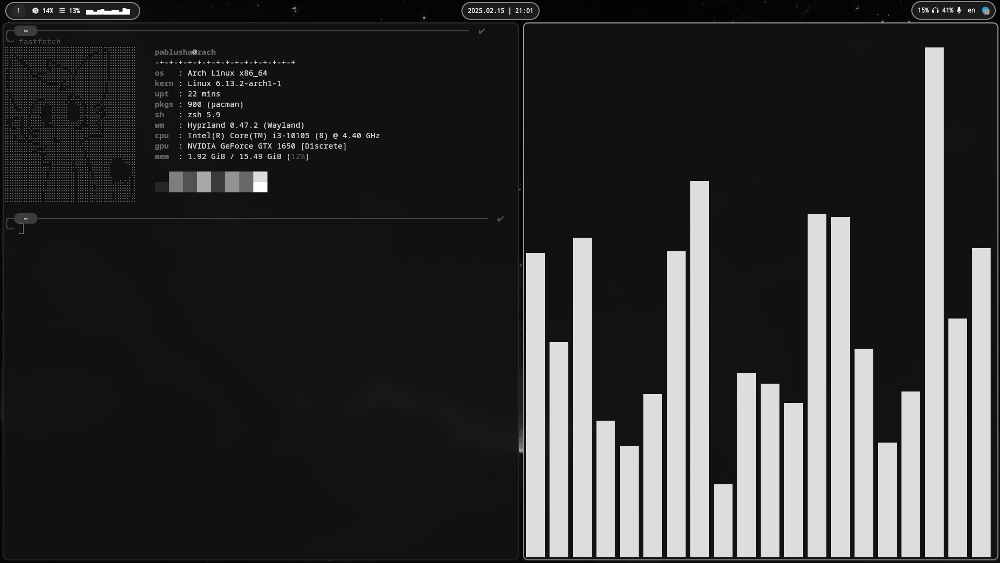

# Installation

- **Run this thing**
```sh
$ sudo pacman -Syu hyprland hyprpaper fastfetch kitty waybar wofi zsh-autosuggestions zsh-syntax-highlighting
$ yay -S cava
```
- **Download and unzip** archive to your ```home``` directory
- **Import** vscode.code-profile to your VS Code
- **Install** [zsh theme](https://github.com/romkatv/powerlevel10k)
- ✅ **Perfect**